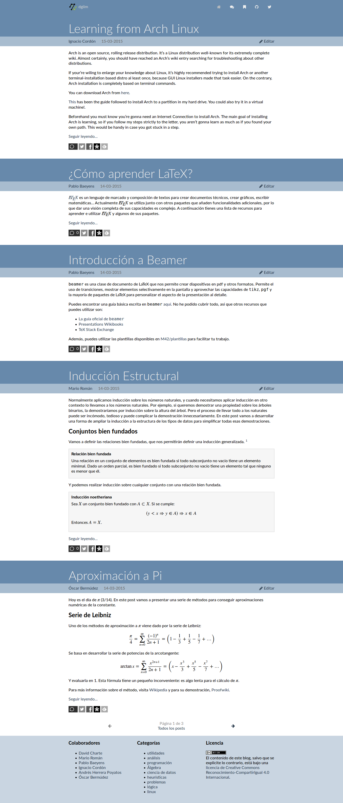
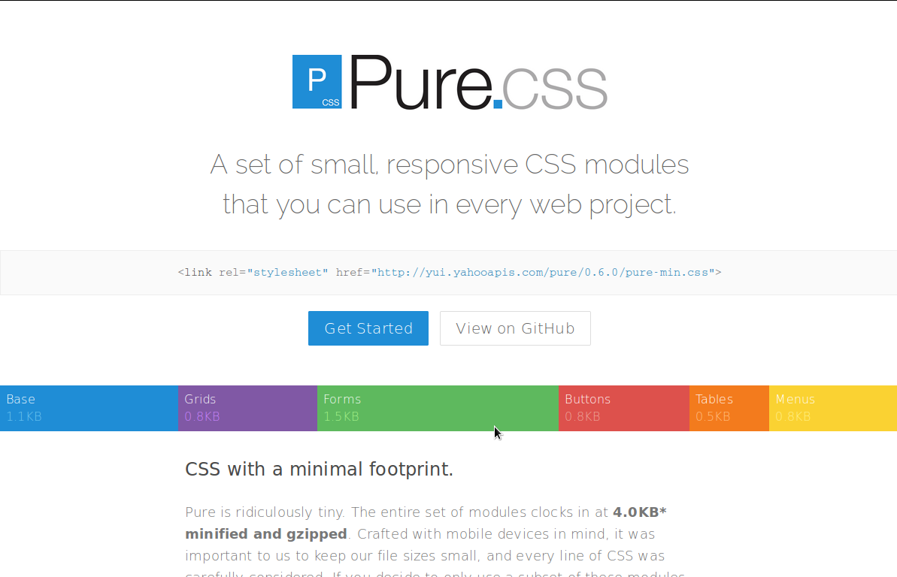
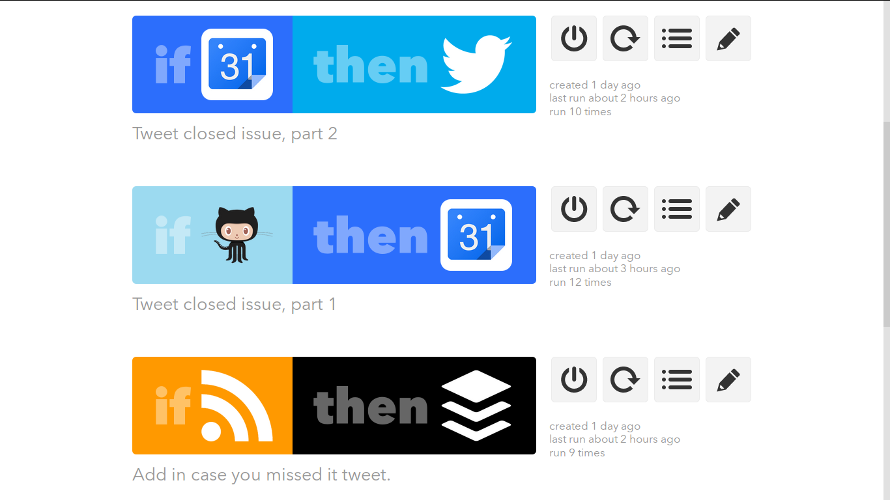

# Colaboraron

@**M42**, @**pbaeyens**, @**robertohueso**, @**JCEntrena**, 
@**m-andres**, @**NCordon**, @**JJ**, @**oxcar103**, @**makixun**, 
@**psicobyte**, @**fdavidcl**

 

# **dgiim.github.io/blog** el viernes

# **dgiim.github.io/blog** hoy

# Pure CSS

# Nuevos artículos

### Aproximación a Pi

### Inducción estructural

### Introducción a Beamer

### ¿Cómo aprender LaTeX?

### Learning from Arch Linux

### ...y más en camino

# Automatización

...de tweets

# Automatización

...de builds

# Más arreglos

## Paginación!

## Carga con HTTPS

## Licencia del código

## ...

# ¡Gracias a todos!{.titleslide}

<!--link href='http://fonts.googleapis.com/css?family=Lato:400,300,700,400italic,700italic' rel='stylesheet' type='text/css'-->
<!--link rel="stylesheet" href="http://code.cdn.mozilla.net/fonts/fira.css" /-->
