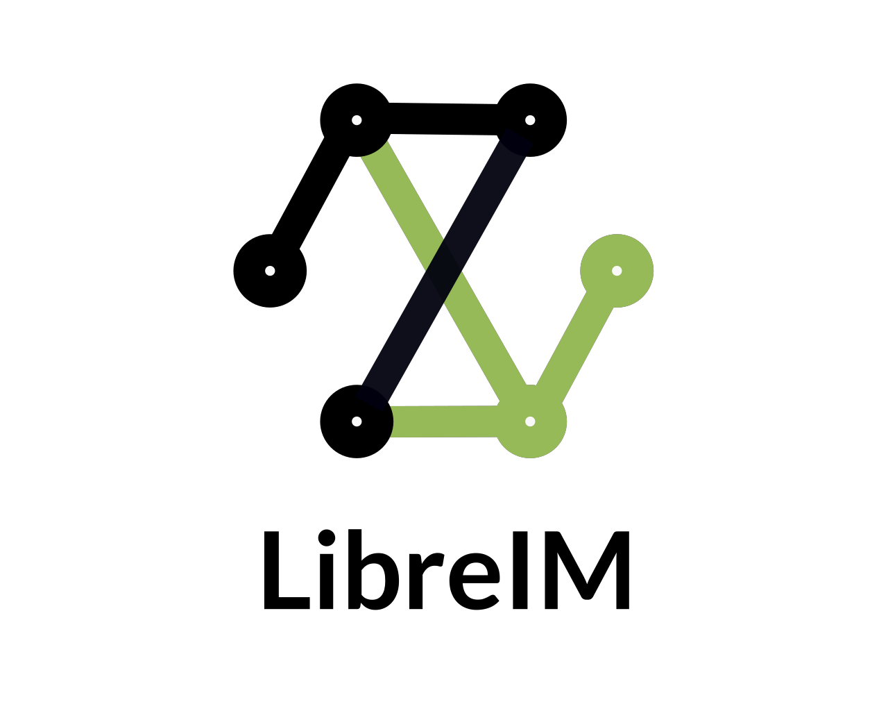
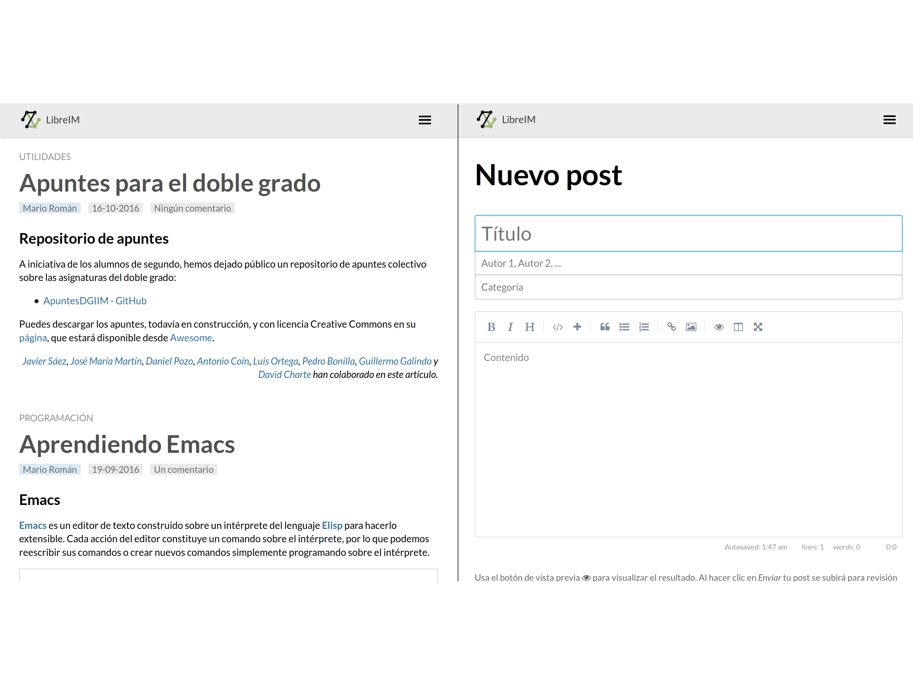
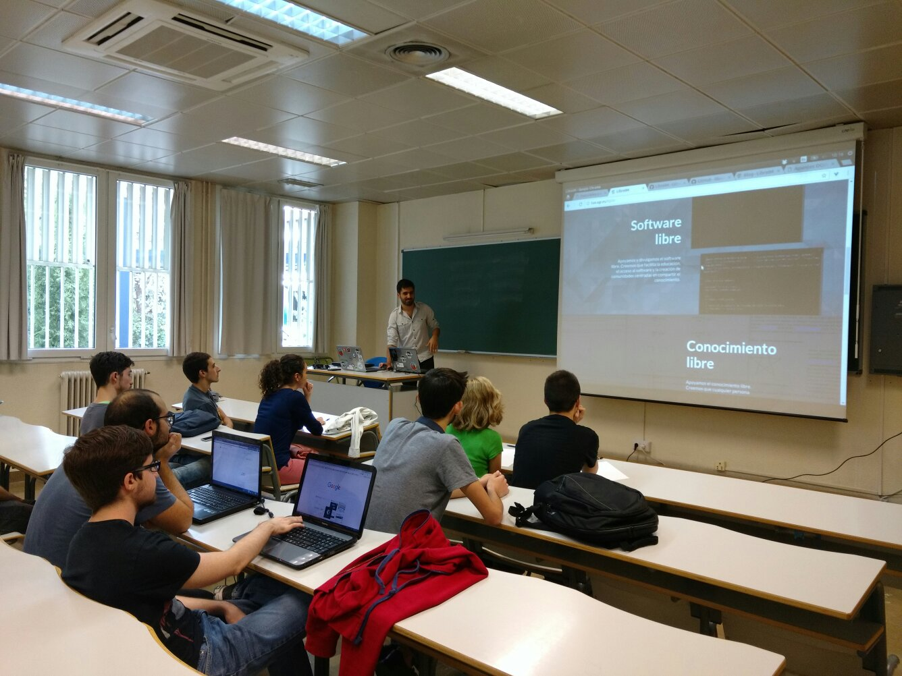
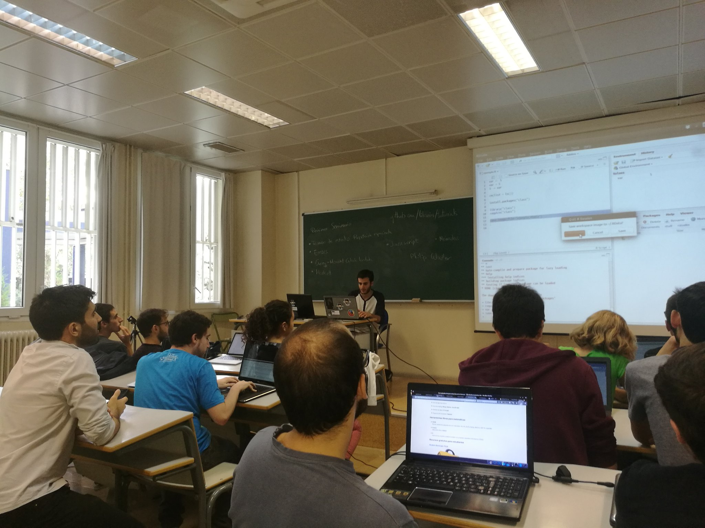
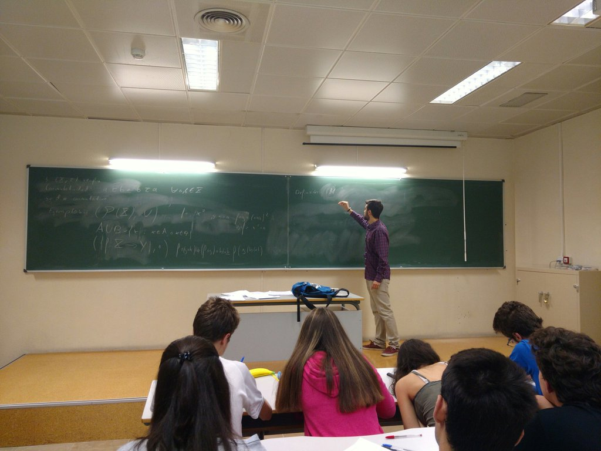
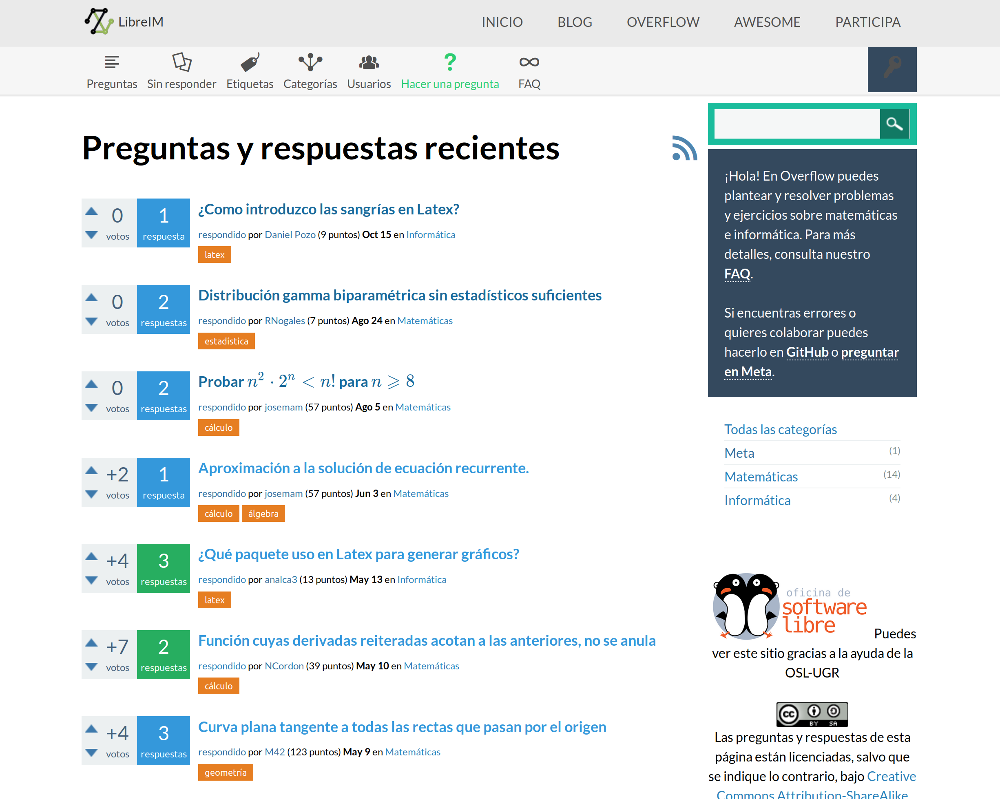
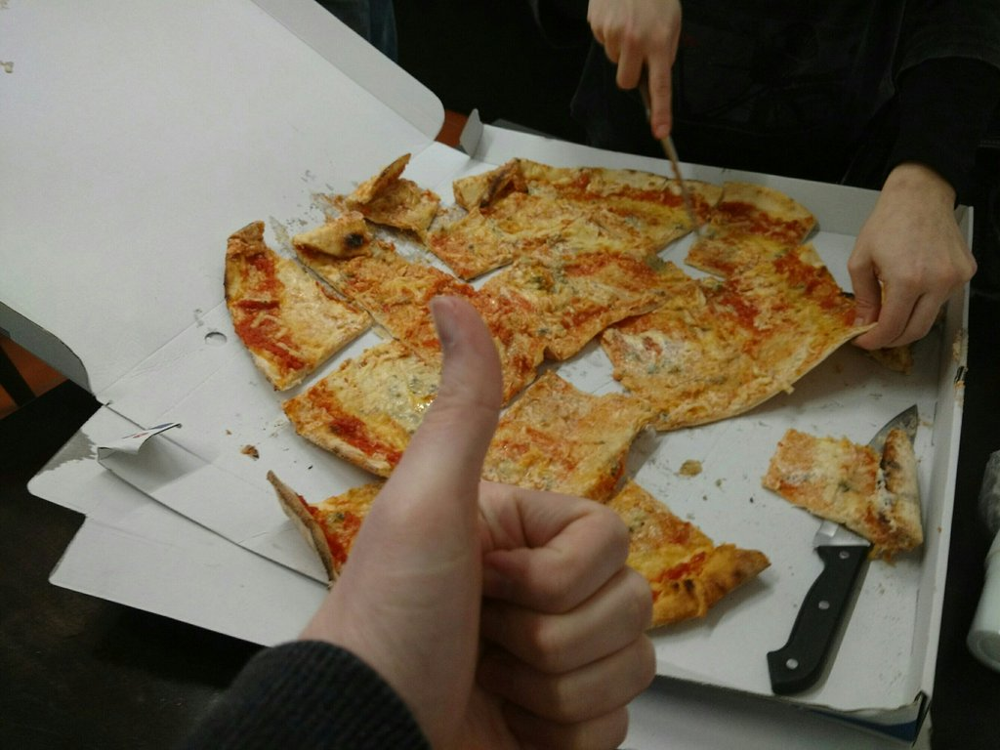
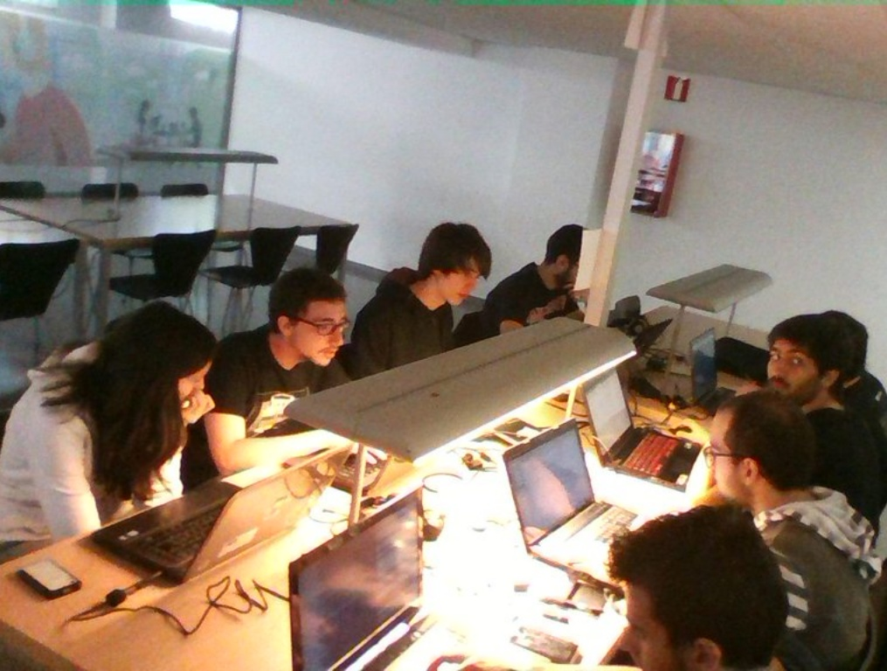
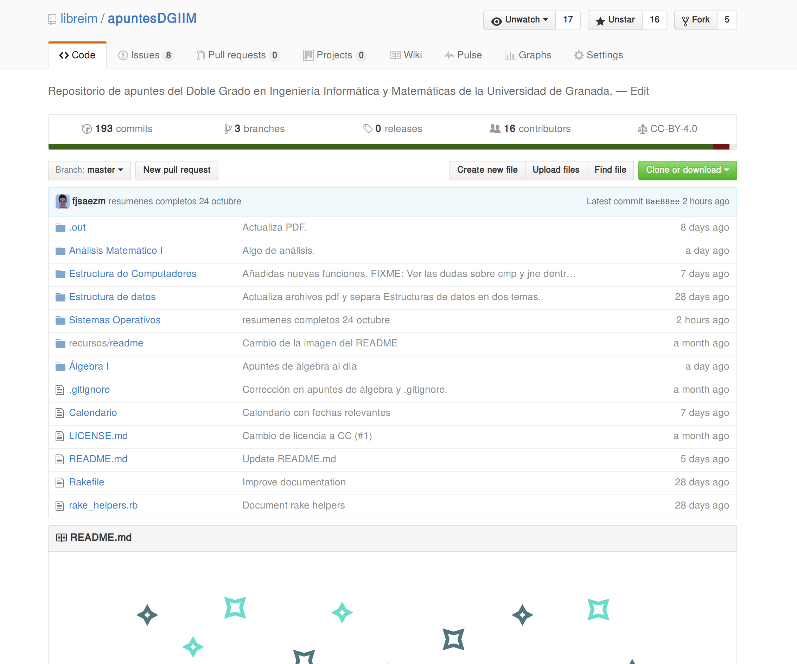

---------------------

---------------------

---------------------

---------------------

---------------------

---------------------

---------------------

---------------------

---------------------

---------------------

<!--

---------------------

---------------------

---------------------
-->

# ¡Gracias por vuestra atención!{.fondaco}

Twitteadnos a **@libreim_**

Encontradnos en github.com/**libreim**
y **tux.ugr.es/dgiim**

<!--link href='http://fonts.googleapis.com/css?family=Lato:400,300,700,400italic,700italic' rel='stylesheet' type='text/css'-->
<!--link rel="stylesheet" href="http://code.cdn.mozilla.net/fonts/fira.css" /-->

