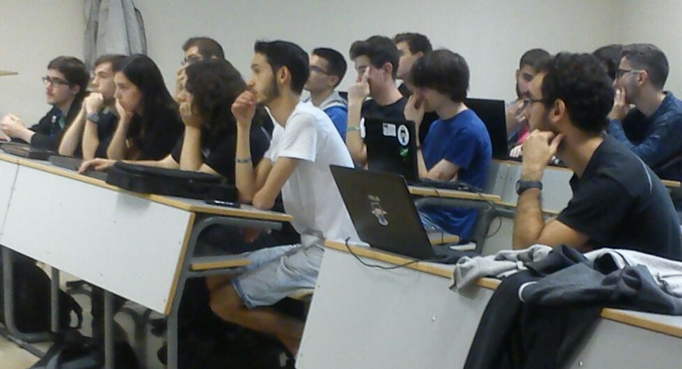
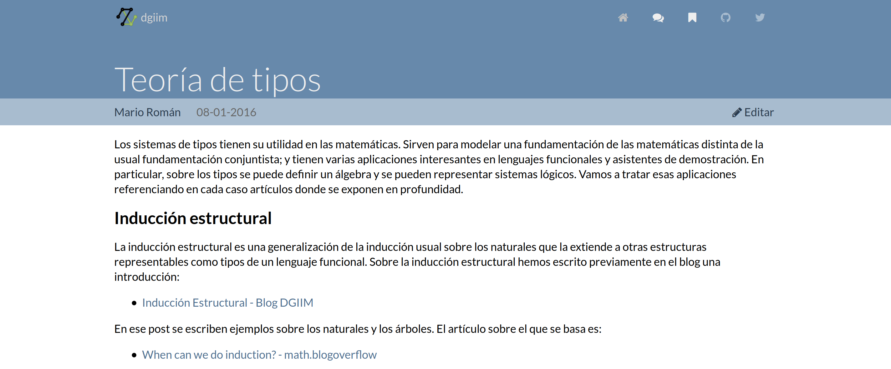
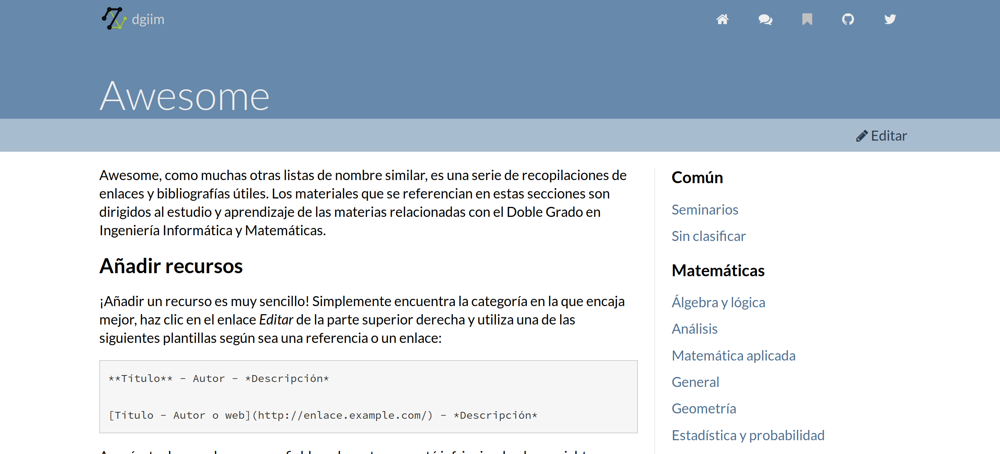
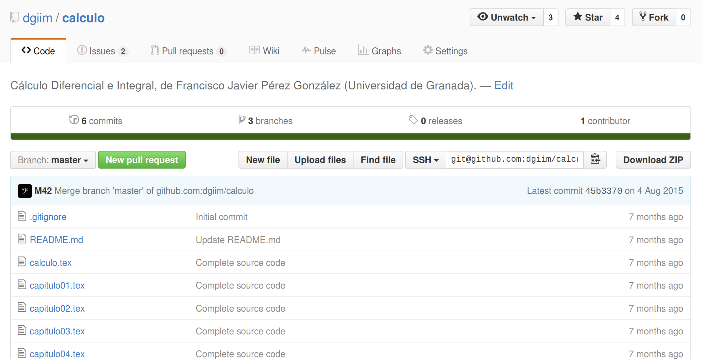

---------------------

## Aprender y escribir sobre Informática y Matemáticas

**@dgiimgr** #hackatonugr

---------------------

Estudiantes y entusiastas de la Informática y las Matemáticas y los campos comunes

**github.com/dgiim**

# ¿Quiénes somos?

---------------------

Generamos contenido didáctico y facilitamos el acceso a buen material existente

# ¿Qué hacemos?

---------------------

* Ampliar **contenidos**: nuevos artículos, nuevos recursos

* Mejorar la **funcionalidad**: editor de artículos, plugins...

* Crear una **página de inicio** informativa

# Planes para el hackatón

---------------------

¿Tienes **algo que contar**? Artículos, tutoriales, problemas y soluciones son bienvenidos

¿Haces **diseño gráfico**? Echa una mano con la página de inicio

¿Programas en **Ruby**? Te necesitamos *behind the scenes*

# ¿Cómo colaborar?

---------------------

* Aprenderás como funciona un sitio en **Jekyll** y cómo se **despliega** a un servidor

* Conocerás los ámbitos donde confluyen las matemáticas y la informática

* La satisfacción de colaborar en la **difusión del conocimiento**

# ¿Y yo qué saco?

---------------------

Twitteadnos a **@dgiimgr**

Encontradnos en github.com/**dgiim**
y **tux.ugr.es/dgiim**

# ¡Gracias por vuestra atención!

<!--link href='http://fonts.googleapis.com/css?family=Lato:400,300,700,400italic,700italic' rel='stylesheet' type='text/css'-->
<!--link rel="stylesheet" href="http://code.cdn.mozilla.net/fonts/fira.css" /-->

